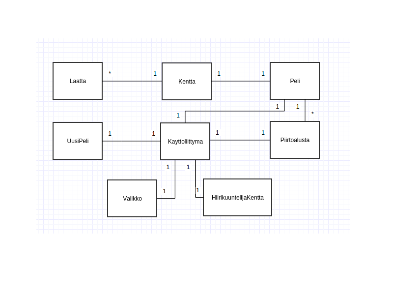

**Aihe:** Miinaharavapeli. Pelaajan yrittää välttää kaikki kenttään piilotetut miinat numerovihjeiden avulla.

Pelin kulku:
Pelaajan pitää klikata auki laattoja pelialueelta. Joidenkin laattojen alla on piilossa miinoja. Avatut laatat kertovat kuinka moneen miinaan ne ovat kosketuksissa. Pelaaja häviää jos laatan alta löytyy miina. Jos pelaaja saa avattua kaikki laatat, joiden alla ei ole miinaa, hän voittaa pelin.

**Käyttäjät:** Pelaaja

**Pelaajan toiminnot:** 

* Kentänkoon/vaikeusasteen valitseminen
* Pelin pelaaminen
* Pelin pausettaminen
* Pelin lopettaminen enen voittoa
* Voiton jälkeen pelaaja valitsee tahtooko uuden pelin vai sulkea ohjelman

